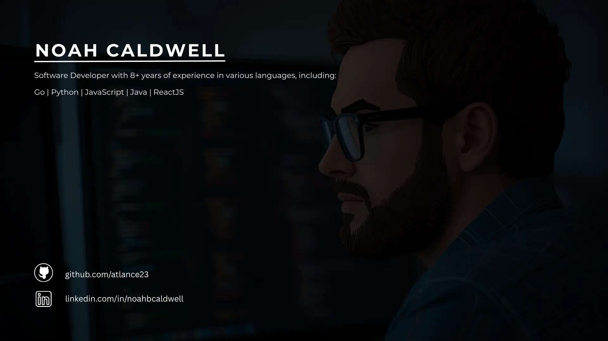

# Looking For an Experienced Software Developer?

    

## Hello! 👋 My name is Noah Caldwell
I am a software developer with 8+ years of experience in various programming languages and frameworks including, but not limited to:
- Go
- JavaScript
- Python
- React.js
- Flask
- Java

### Github Stats
    

    

### Backend Languages
- Go
- Python
- Java

### Frontend Frameworks
- React

### Build tools
- Vite

## Experience
- Invictus Consulting | Independent Software Developer
- Invictus Consulting | Application Security Consultant
- Invictus Consulting | Independent Web Developer

## Education
- M.S. Computer Science | Austin Peay State University
- B.S. Computer Science | Austin Peay State University
- A.A.S. Computer Information Technology | Dyersburg State Community College
